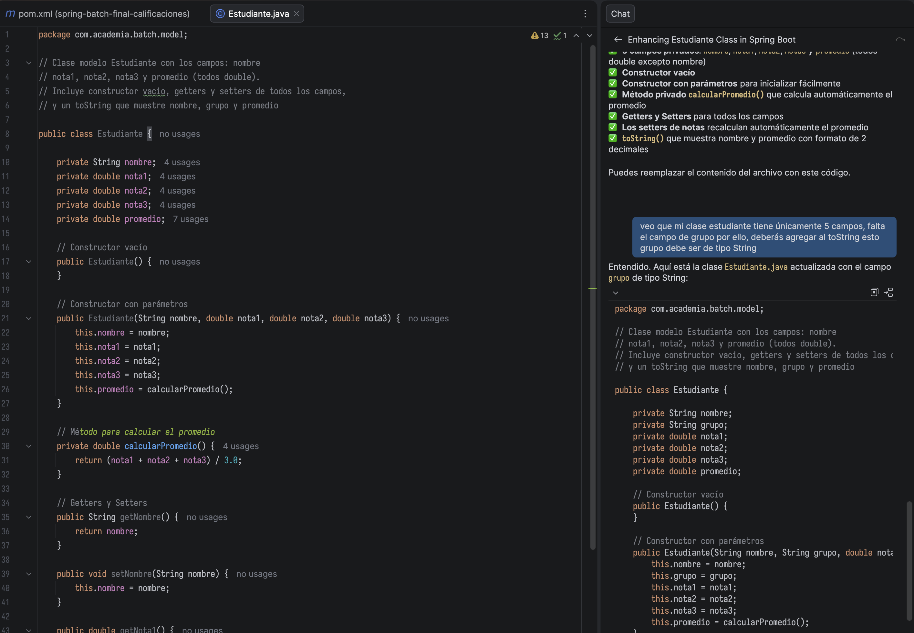
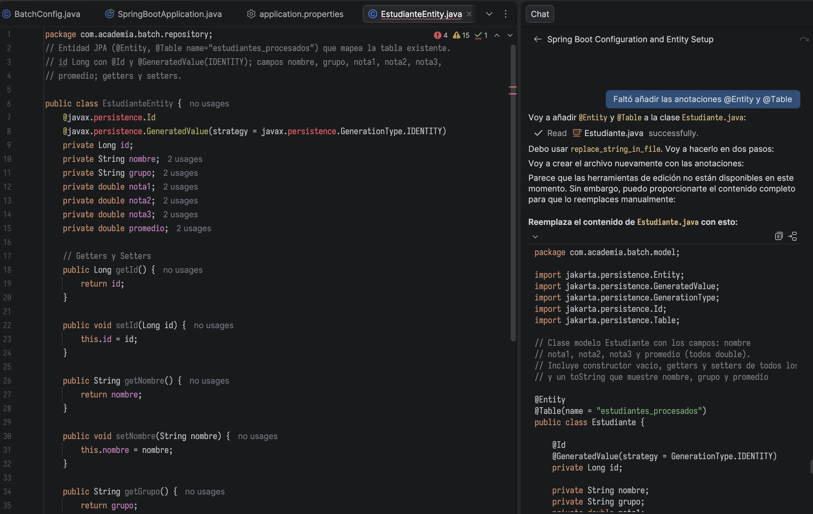
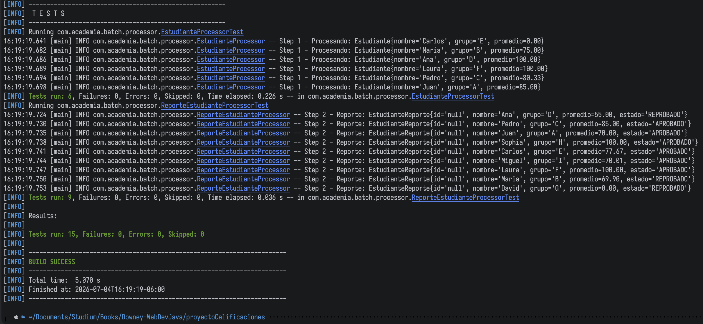
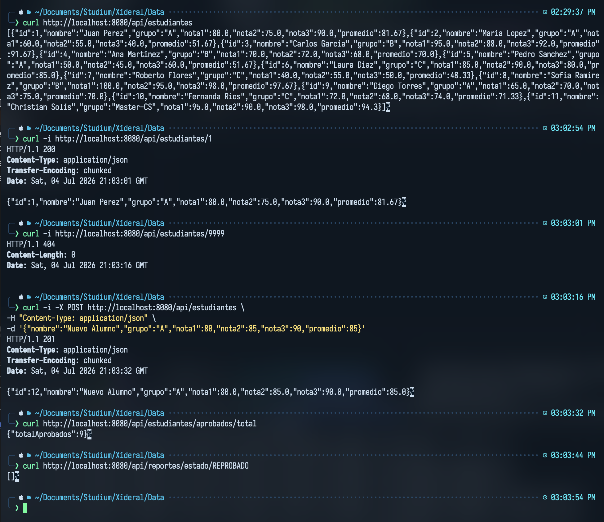

# Registro de Prompts y Decisiones

1. **Prompt:** "Genera una clase Estudiante con campos nombre, grupo y calificaciones."
    - **Corrección:** Se añadió el campo `grupo` y se corrigió el `toString()` que la IA olvidó originalmente.
    - **Evidencia:** 

2. **Prompt:** "Configura la clase Estudiante como una entidad de JPA para conectarse a MySQL."
    - **Corrección:** Se añadieron manualmente las anotaciones `@Entity` y `@Table(name = "estudiantes_procesados")` para asegurar la persistencia.
    - **Evidencia:** 

3. **Prompt:** "Desarrolla la interfaz ReporterRepository para Spring Data MongoDB."
    - **Decisión:** Se definió la extensión de `MongoRepository` con métodos para consultas por grupo y estado, validando la estructura del repositorio.
    - **Evidencia:** 

4. **Prompt:** "Crea un servicio para contar estudiantes aprobados usando Mockito."
    - **Validación:** Se ejecutó `mvn test` confirmando que la lógica del servicio es correcta bajo el escenario de pruebas unitarias con un `BUILD SUCCESS`.
    - **Evidencia:** 

5. **Prompt:** "Genera los comandos curl para validar el endpoint GET /api/estudiantes."
    - **Validación:** Se ejecutaron pruebas con `curl` para verificar la correcta respuesta HTTP 200 y el formato JSON de los registros.
    - **Evidencia:** 

6. **Prompt:** "Ajusta el procesador para clasificar alumnos con promedio < 70 como REPROBADO."
    - **Validación:** Se realizó una petición POST con nuevos datos y se corroboró la correcta clasificación mediante el endpoint de consulta y la persistencia en base de datos.
    - **Evidencia:** 