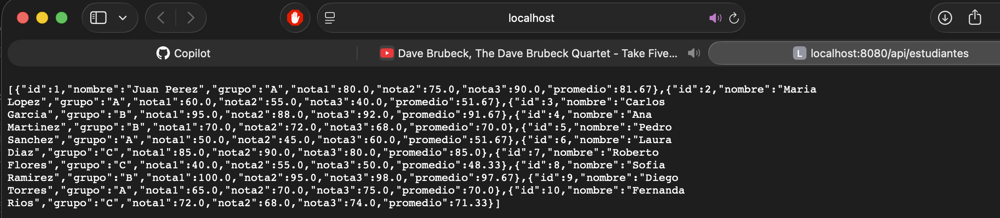

# Proyecto: Sistema de Calificaciones (Batch + API REST)

Proyecto final del módulo de Java con Copilot, que integra procesamiento Batch de archivos CSV y exposición de datos mediante una API REST utilizando Spring Boot, MySQL y MongoDB.

## Instrucciones para ejecutar
1. **Requisitos**: Tener Docker corriendo (para las bases de datos) y Java 17+.
2. **Ejecución**:
    - Abre la terminal en la raíz del proyecto.
    - Ejecuta: `mvn spring-boot:run`
3. **Puertos**:
    - La API corre por defecto en el puerto **8080**.
    - Asegúrate de que los contenedores de MySQL y MongoDB estén activos en sus respectivos puertos (usualmente 3306 y 27017).

## Evidencia
- **Consulta en navegador:** Muestra la lista de registros procesados con su promedio. 
- **Pruebas CURL:** Validación de endpoints. 